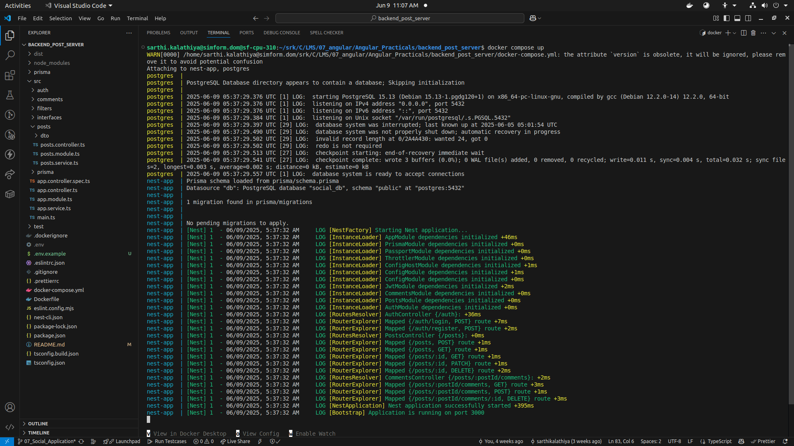
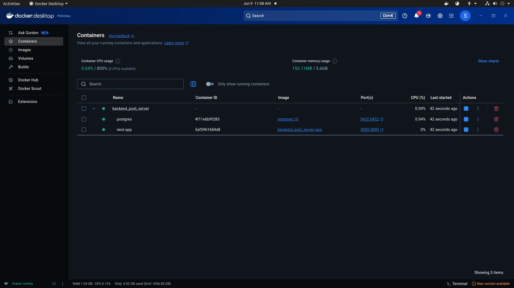
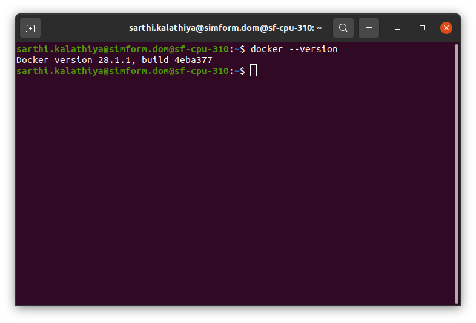
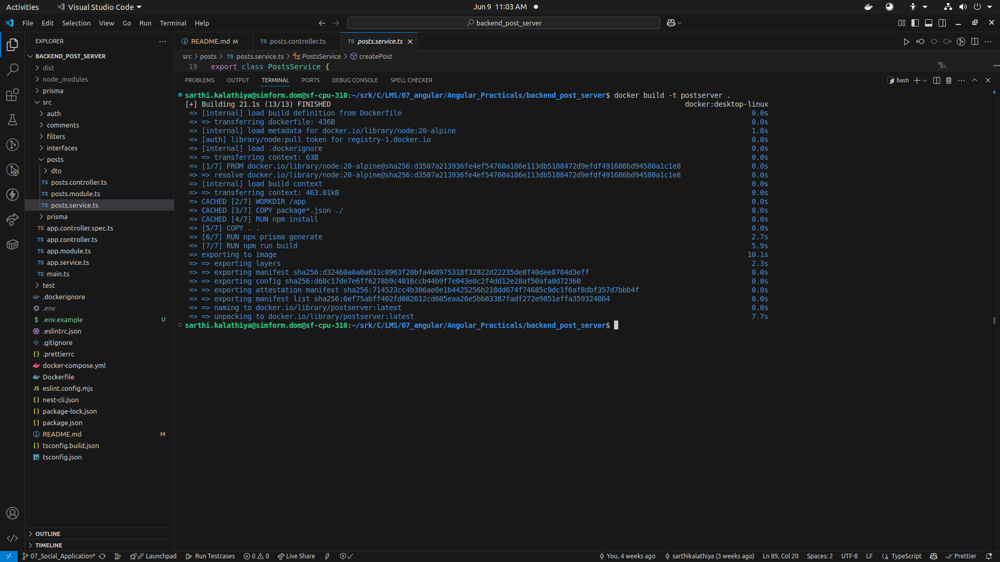
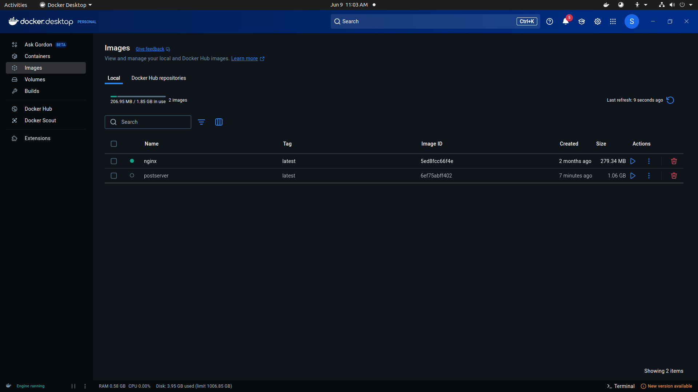
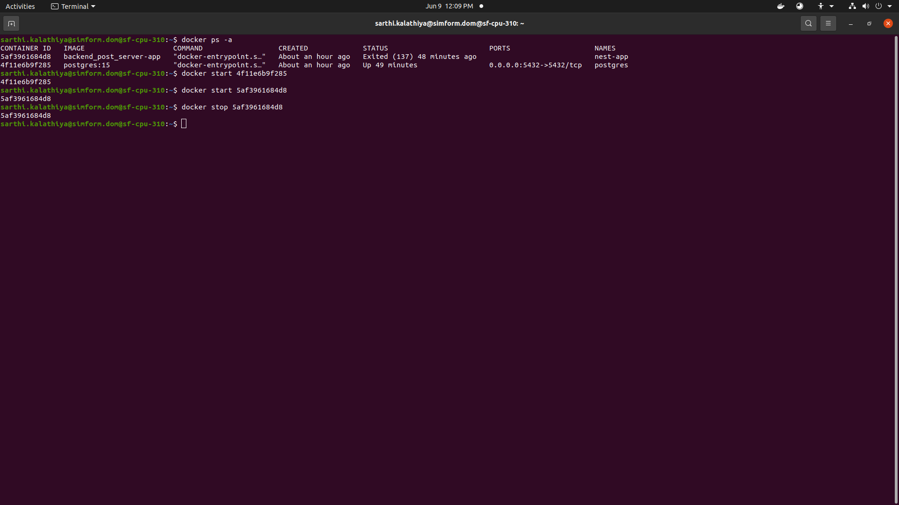

# Social Media Backend API

A robust REST API backend built with NestJS for a social media application that supports user authentication, posts, and comments.

## Features

### Authentication

- User registration with email and password
- Secure login with JWT tokens
- Password hashing using bcrypt
- Rate limiting on login attempts
- Protected routes using JWT guard

### Posts

- Create, read, update, and delete posts
- List all posts with author information
- Get single post with comments
- Posts linked to authenticated users
- Authorization checks for update/delete operations

### Comments

- Add comments to posts
- Delete comments
- Comments linked to both posts and users
- Authorization checks for delete operations

## Tech Stack

- **Framework**: NestJS
- **Language**: TypeScript
- **Database**: PostgreSQL
- **ORM**: Prisma
- **Authentication**: JWT (JSON Web Tokens)
- **Password Hashing**: bcrypt
- **API Security**:
  - Rate limiting
  - Input validation
  - CORS enabled
  - Global exception handling

## Prerequisites

- Node.js (v20 or later)
- PostgreSQL
- Docker (optional)

## Installation

1. Clone the repository:

```bash
git clone https://github.com/srk-simform/backend_post_server
cd backend_post_server
```

2. Install dependencies:

```bash
npm install
```

3. Set up environment variables:

```bash
# Create .env file
cp .env.example .env
```

4. Initialize database:

```bash
# Generate Prisma client
npx prisma generate

# Run migrations
npx prisma migrate dev
```

## Running the Application

### Development

```bash
# Run in development mode
npm run start:dev
```

### Production

```bash
# Build the application
npm run build

# Start production server
npm run start:prod
```

### Docker

```bash
# Start all services
docker-compose up -d

# Stop all services
docker-compose down
```




## API Endpoints

### Authentication

- `POST /auth/register` - Register new user
- `POST /auth/login` - Login user

### Posts

- `GET /posts` - Get all posts
- `GET /posts/:id` - Get single post
- `POST /posts` - Create new post
- `PATCH /posts/:id` - Update post
- `DELETE /posts/:id` - Delete post

### Comments

- `GET /posts/:postId/comments` - Get all comments for a post
- `POST /posts/:postId/comments` - Add comment to post
- `DELETE /posts/:postId/comments/:id` - Delete comment

## Error Handling

The application uses a global exception filter that handles:

- Validation errors
- Authentication errors
- Database errors
- Not found errors
- Permission errors

## Security Features

- Password hashing using bcrypt
- JWT-based authentication
- Rate limiting on sensitive endpoints
- Input validation using class-validator
- CORS protection
- SQL injection protection via Prisma ORM

## Practical: Dockerizing the NestJS Application

### 1. Install Docker

I Followed the [official Docker installation guide](https://docs.docker.com/get-docker/) for your operating system.


### 2. Create a Dockerfile

In your project root, create a `Dockerfile`:

```dockerfile
# Use official Node.js image
FROM node:20-alpine

# Create app directory
WORKDIR /app

# Install app dependencies
COPY package*.json ./
RUN npm install

# Copy app source
COPY . .

# Generate Prisma client
RUN npx prisma generate

# Build app
RUN npm run build

# Expose app port
EXPOSE 3000

# Start app
# CMD ["node", "dist/main"]
CMD ["sh", "-c", "npx prisma migrate deploy && node dist/main"]
```

### 3. Build the Docker Image

```bash
docker build -t postserver .
```




### 4. Manage Docker Containers

- **List containers:**
  ```bash
  docker ps -a
  ```
- **Start container:**
  ```bash
  docker start container-id
  ```
- **Stop container:**
  ```bash
  docker stop container-id
  ```


Below is a screenshot demonstrating the Docker operations:


